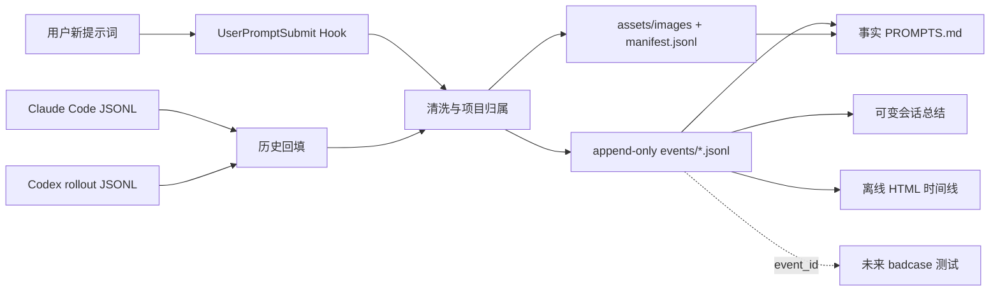

# Prompt Harness

[](https://github.com/24kchengYe/prompt-harness)
[](https://github.com/24kchengYe/prompt-harness)
[](LICENSE)
[](https://www.python.org/)

**把散落在 Claude Code 和 Codex 会话中的人类提示词，变成每个项目私有、可追溯、可检索的事实层。**

Prompt Harness 同时提供实时 `UserPromptSubmit` Hook 和历史会话回填。它只保留用户真正输入的指令与用户发送的图片，排除助手回复、工具输出、子代理、自动注入上下文和导入镜像，并生成带图片的事实 Markdown、会话索引和一个无需服务器的交互式 HTML 时间线。

这个事实层将作为后续 badcase 分析、可复现测试和跨模型回归的稳定输入。

> 当前版本完成 Phase 1：提示词捕获与事实化。Phase 2 的 badcase harness 已预留命名空间，但尚未实现失败分类、测试运行和模型回归。

## 它解决什么问题

一次真实项目往往分散在多个 Claude、Codex、分支会话和导入归档里。直接分析原始 JSONL 会遇到几个问题：

- 人类输入和助手回复、工具调用、环境注入混在一起；
- Claude 分支会复制历史消息，Codex 导入 Claude 后还会形成镜像；
- 用户很难按项目重新找到“我当时到底要求 AI 做了什么”；
- 会话总结会变化，不能与原始提示词事实混在同一个文件里；
- 后续 badcase 测试需要稳定 ID，而不是依赖某个聊天窗口仍然存在。

Prompt Harness 将这些内容整理为：

```text
项目 → 会话 → 按时间排列的用户提示词事件 → 可引用的 event_id
```

每条事实记录都可以包含平台、时间、会话、模型、来源和哈希；总结与可视化则是随时可以重建的派生视图。

## 核心能力

| 能力 | 说明 |
|---|---|
| 实时捕获 | 通过 `UserPromptSubmit` Hook 在用户提交提示词时快速追加一条事件 |
| 历史回填 | 扫描本地 Claude Code 与 Codex JSONL，恢复当前项目的历史人类输入 |
| 跨平台标记 | 每条记录明确区分 `claude` 与 `codex` |
| 模型元数据 | 优先使用 Hook 捕获值；历史记录可从 Claude assistant 行或 Codex `turn_context` 可靠推导 |
| 图片归档 | 保存用户发送的常见栅格图片，按内容哈希去重并嵌入 `PROMPTS.md`；不联网下载 |
| 文件附件 | 普通文件不复制正文，只在能解析时把附件路径保留在提示词事实中 |
| 去重与镜像排除 | 合并 Claude 分支历史副本，排除导入 Codex 的 Claude 镜像，同时保留真正的 Codex 续写 |
| 事实与总结分离 | `PROMPTS.md` 只记录事实；可变化的会话与项目总结单独放在 `reports/` |
| 离线可视化 | 生成单文件 `timeline.html`，支持会话节点、搜索、Claude/Codex 筛选和提示词展开 |
| 隐私保护 | 默认不提交提示词与图片数据，省略普通附件正文并遮盖常见密钥、Token 和密码形态 |
| 可验证性 | `doctor` 检查事件 ID、哈希、项目归属、隐私清洗和 JSONL 完整性 |

## 工作方式



Hook 路径保持有界：定位项目、清洗一条提示词、加锁追加 JSONL；如有图片，再校验并复制到本地内容哈希路径。实时捕获不会做全盘扫描、网络请求或模型调用。

## 从公开 GitHub 安装到 Codex

仓库地址：[github.com/24kchengYe/prompt-harness](https://github.com/24kchengYe/prompt-harness)

Codex CLI 可以直接把这个公开仓库注册为远程 marketplace：

```powershell
codex plugin marketplace add 24kchengYe/prompt-harness --ref main
codex plugin add prompt-harness@24kchengye
```

安装后请：

1. 新建或重新打开一个 Codex 任务；正在运行的旧任务不会热加载刚安装的 Hook。
2. 在 Codex 中运行 `/hooks`，检查并信任 Prompt Harness 的 `UserPromptSubmit` Hook。
3. 在目标项目里发送一条测试提示词。
4. 用后文的 `doctor` 命令验证是否已写入。

查看安装状态：

```powershell
codex plugin list
```

更新远程 marketplace 和插件：

```powershell
codex plugin marketplace upgrade 24kchengye
codex plugin add prompt-harness@24kchengye
```

卸载插件：

```powershell
codex plugin remove prompt-harness@24kchengye
codex plugin marketplace remove 24kchengye
```

## 从源码安装或开发

```powershell
git clone https://github.com/24kchengYe/prompt-harness.git
cd prompt-harness
```

如果你已经维护自己的本地 Codex marketplace，可以把本仓库作为一个本地插件源注册；本仓库根目录包含 `.codex-plugin/plugin.json`，远程 marketplace 清单位于 `.agents/plugins/marketplace.json`。

本项目运行时仅使用 Python 标准库，不需要 `pip install`。要求 Python 3.10 或更高版本。

## 为 Claude Code 安装 Hook

Codex 推荐使用上面的插件方式。Claude Code 使用仓库内的安全安装器：

```powershell
# 先预览，不修改配置
python scripts/install_hooks.py --platform claude --dry-run

# 确认后安装
python scripts/install_hooks.py --platform claude
```

macOS/Linux 可将 `python` 替换为 `python3`。

安装器会：

- 保留已有的无关 Hook；
- 在实际修改前创建带时间戳的配置备份；
- 只写入 Prompt Harness 的 `UserPromptSubmit` 项；
- 不读取或上传认证信息。

移除 Claude Code Hook：

```powershell
python scripts/install_hooks.py --platform claude --remove
```

不要同时启用 Codex 插件 Hook 和 Codex 全局独立 Hook，否则同一条提示词可能被捕获两次。

## 快速开始

你可以直接在 Codex 中用自然语言要求插件技能执行：

```text
为当前项目初始化 Prompt Harness。
回填这个项目所有 Claude Code 和 Codex 的用户提示词并校验。
搜索我之前关于 major revision 的提示词。
```

也可以直接使用 CLI。

### 1. 初始化项目

```powershell
python scripts/prompt_harness.py init --project "G:\path\to\project"
```

这会在目标项目根目录创建 `.prompt-harness/`，不会把提示词写回插件仓库。

### 2. 回填历史提示词并生成视图

```powershell
python scripts/prompt_harness.py backfill `
  --project "G:\path\to\project" `
  --platform all `
  --rebuild-index
```

macOS/Linux：

```bash
python3 scripts/prompt_harness.py backfill \
  --project "/path/to/project" \
  --platform all \
  --rebuild-index
```

### 3. 搜索用户提示词

```powershell
python scripts/prompt_harness.py search "major revision" `
  --project "G:\path\to\project" `
  --limit 20
```

需要机器可读结果时增加 `--format json`。

### 4. 重建 Markdown、总结和 HTML

```powershell
python scripts/prompt_harness.py rebuild-index --project "G:\path\to\project"
```

### 5. 校验项目事实库

```powershell
python scripts/prompt_harness.py doctor --project "G:\path\to\project"
```

一次正常结果类似：

```json
{
  "ok": true,
  "event_count": 388,
  "image_count": 12,
  "errors": [],
  "warnings": []
}
```

### 6. 显式修复旧账本

当新版本扩展了密钥识别或自动上下文过滤规则时，可以显式修复已经生成的本地账本：

```powershell
python scripts/prompt_harness.py scrub-secrets --project "G:\path\to\project"
python scripts/prompt_harness.py clean-store --project "G:\path\to\project"
python scripts/prompt_harness.py doctor --project "G:\path\to\project"
```

`scrub-secrets` 只重新遮盖新识别出的敏感值；`clean-store` 会移除中断通知、重复的 Codex goal 续跑包装等非人类记录，并把附件包装压缩为“用户文字 + 引用路径”。这两个命令不会自动运行，修复时保留原有 `event_id`，随后重建派生视图。

### 7. 兼容安装插件前已经存在的 Codex 任务

部分旧任务会保留创建时的插件 Hook 集合。若新任务的 `UserPromptSubmit` 正常、旧任务仍不触发，可安装轻量的轮末恢复 Hook：

```powershell
python scripts/install_hooks.py --platform codex --codex-hook stop-recovery
```

它在每轮结束后根据该任务的 `session_id` 只读取对应 rollout 的最后一条人类输入，记录为 `Source mode: stop_recovery`。它可以与插件的即时 Hook 共存；相同 `turn_id` 会阻止重复写入。安装后仍需在 `/hooks` 中检查并信任新增命令。

## 每个项目会生成什么

```text
<project>/.prompt-harness/
├── config.json                       # 项目标识与隐私策略
├── events/YYYY/MM/prompts-*.jsonl    # 追加写入的事实源
├── assets/
│   ├── images/<sha256>.*              # 用户发送的内容寻址图片
│   └── manifest.jsonl                 # 图片与 event_id 的追加式关系
├── sessions/
│   ├── claude/*.json                 # Claude 会话派生元数据
│   └── codex/*.json                  # Codex 会话派生元数据
├── index/
│   ├── catalog.json                  # 数量、平台和时间覆盖
│   ├── sessions.json                 # 会话分组
│   └── PROMPTS.md                    # 纯事实提示词 Markdown
├── reports/
│   ├── SESSION_SUMMARIES.md          # 提示词派生、可变化的会话摘要
│   └── PROJECT_SUMMARY.md            # 可选的项目分析总结
├── visualizations/
│   └── timeline.html                 # 单文件离线时间线
├── state/                            # 写入锁与诊断状态
└── badcases/                         # Phase 2 预留空间
```

### 事实层与派生层

| 类型 | 文件 | 规则 |
|---|---|---|
| 权威事实 | `events/**/*.jsonl` | 日常写入 append-only；只有显式修复命令会净化旧行 |
| 图片事实 | `assets/images/`、`assets/manifest.jsonl` | 图片按哈希存储；关系按 `event_id` 追加 |
| 可读事实 | `index/PROMPTS.md` | 只有最小标题、逐条元数据和完整清洗后提示词 |
| 派生索引 | `catalog.json`、`sessions.json` | 可以重建 |
| 可变总结 | `reports/*.md` | 允许随新会话改变结论 |
| 可视化 | `visualizations/timeline.html` | 可以重建，不是事实源 |

每条事件都带有稳定的 `event_id`。未来 badcase 记录只引用这个 ID，不复制或修改原始提示词。

## 一条提示词记录包含什么

可读 Markdown 中的单条记录类似：

````markdown
## P00042

- Time: `2026-07-14T06:08:33.759Z`
- Platform: `codex`
- Model: `gpt-5.6-sol`
- Session: `...`
- Event: `phe_...`
- Source mode: `hook`
- Images: `1`

```text
用户实际输入的提示词
```


````

平台始终显示。模型只在有可靠证据时显示：

- 实时 Hook：使用 Hook 负载中的模型字段；
- Claude 历史：从该用户消息后续的 assistant 模型字段推导；
- Codex 历史：从该轮 `turn_context` 推导；
- 无可靠来源：显示 `unavailable`，不猜测；
- `<synthetic>` 等内部占位值不会被当作模型名。

## 哪些内容会保存

保存：

- 用户实际输入的提示词文本；
- Claude/Codex 平台标记；
- 会话、轮次、时间、项目根目录和来源引用；
- 可获得的模型与权限模式；
- SHA-256、清洗统计和未来 badcase 链接。
- 用户发送的 PNG、JPEG、GIF、WebP、BMP 图片，以及图片与提示词事件的关系。

排除：

- 助手回复和 reasoning；
- 工具调用、工具结果和终端输出；
- subagent、sidechain 和自动压缩通知；
- 注入的 `AGENTS.md`、环境、权限与续写包装；
- Codex 的 `turn_aborted`、内部建议生成和重复 goal 续跑包装；
- 普通文件、文档及其他非图片附件正文；
- Codex 中仅仅镜像 Claude 历史的导入行。

如果用户在提示词中手动写了文件路径，或者普通附件块中能解析出本地路径，路径文本会保留；Prompt Harness 不会为了归档而打开这个普通文件并复制正文。图片是明确例外：用户发送的常见栅格图片会保存到 `.prompt-harness/assets/images/`，远程 URL 不下载，SVG 不保存。

## 去重原则

Prompt Harness 不会简单地按文本去重，因为用户可能在不同时间有意重复同一句话。

- Claude 分支复制：按原生事件、时间戳和提示词哈希识别历史副本，并保留全部来源引用；
- Codex 导入镜像：导入时间范围内的 Claude 镜像不重复计入；
- 旧 Codex 任务：可通过 `capture-stop-recovery` 在该轮结束后只读取本任务 rollout 的最后一条人类输入；
- Windows 上转发 Stop payload 时固定使用 UTF-8；若复用已有 Stop adapter，应使用 `ensure_ascii=True` 序列化，并为子进程显式设置 `encoding="utf-8"` 与 `PYTHONIOENCODING=utf-8`，避免 GBK 遇到孤立 Unicode 字符后漏记；
- Codex 真实续写：超过原 Claude 会话结束时间的新用户输入仍然保留；
- 实时重复输入：如果用户确实提交了两次，则保留两个事件；
- 回填与 Hook 对账：按平台、会话和提示词出现次数避免再次写入已捕获事件。

## HTML 时间线

`visualizations/timeline.html` 是一个完全自包含的本地文件：

- 不需要服务器、数据库、CDN 或网络连接；
- 按项目和会话排列提示词节点；
- Claude 与 Codex 使用不同颜色；
- 支持全文搜索和平台筛选；
- 点击节点可查看原始用户提示词及模型来源；
- 鼠标经过轨道时会产生轻量波动；
- 支持键盘焦点、小屏布局和 `prefers-reduced-motion`。

HTML 读取的是重建后的事实视图，不包含助手输出。

## 隐私与发布边界

提示词可能包含未发表研究、私人路径和认证信息。因此默认策略是：**代码可以公开，项目提示词库保持私有。**

每个 `.prompt-harness/` 内置嵌套 `.gitignore`，默认排除：

- `events/`
- `sessions/`
- `index/`
- `reports/`
- `assets/`
- `visualizations/`
- `state/`
- badcase case/run 数据

此外：

- 常见 API Key、access token、password 和 bearer token 会被替换；
- 用户图片只保存在私有的 `assets/images/`；普通文件正文与非图片 base64 载荷会省略；
- 全局注册表 `~/.prompt-harness/projects.json` 只记录项目位置，不存提示词；
- 任何公开导出前都应运行 `doctor`，并人工检查或使用 secret scanner。

自动遮盖只是安全网，不等于任意秘密都能被百分之百识别。详见 [PRIVACY.md](PRIVACY.md)。

## 常见问题

### 安装后为什么没有实时记录？

先运行 `/hooks` 并信任 Hook，然后新建任务做基准测试。已经运行的旧任务通常不会热加载后来安装的插件；重启后重新打开能否补挂 Hook 还取决于 Desktop 版本和任务来源，Claude 导入任务尤其应实测。旧任务中遗漏的输入可以通过 `backfill` 补回。

### 为什么记录显示 `Source mode: backfill`？

说明它来自历史 JSONL 扫描，而不是提交瞬间的 Hook。它仍然是有效事实，并保留原始文件与行号来源。

### 为什么模型显示 `unavailable`？

该条记录没有可靠模型字段，或原始日志无法访问。Prompt Harness 不会根据会话标题猜模型。

### 为什么同一条提示词出现两次？

先确认用户是否真的提交了两次。如果是实时重复输入，应当保留。若事件来源都为 Hook，则检查是否同时启用了插件 Hook 和 Codex 全局独立 Hook。

### 为什么历史数量明显过多？

检查是否误纳入 subagent、Claude 分支复制、自动注入或 Claude-to-Codex 镜像。当前回填器默认排除这些来源。

### HTML 没有更新怎么办？

重新执行：

```powershell
python scripts/prompt_harness.py rebuild-index --project "<project-root>"
```

### Hook 会拖慢每次对话吗？

实时路径只做本地文本清洗、追加和有界图片复制，不扫描全部历史，不联网，也不调用模型。历史扫描只在显式运行 `backfill` 时发生。

## 故障排查顺序

当 Hook 没有记录时，建议依次检查：

1. `codex plugin list` 中插件是否为 `installed, enabled`；
2. `/hooks` 中 `UserPromptSubmit` 是否已信任；
3. 当前任务是否在安装或信任之后新建；
4. Hook 负载中的 `cwd` 是否能定位到正确项目；
5. 项目下是否生成 `.prompt-harness/state/hook-misses.jsonl`；
6. 运行 `backfill` 和 `doctor`，判断是实时链路问题还是事实库问题。

不要通过直接改写 canonical JSONL 来“修复”计数。优先修复采集逻辑、追加补偿事件，或执行有来源记录的迁移。

## 项目边界

当前版本会做：

- 提示词捕获、回填、清洗、去重、搜索、索引和可视化；
- 为未来 badcase 提供稳定 `event_id` 和项目级目录结构。

当前版本不会做：

- 保存或评判助手回复；
- 自动认定一次会话是否成功；
- 上传提示词到云端；
- 读取用户提示词中引用的文件正文；
- 下载远程图片 URL 或保存 SVG；
- 自动发布项目提示词数据；
- 执行 Phase 2 的 badcase 回归测试。

## Badcase Harness 路线图

未来 badcase 层计划通过 `event_id` 引用提示词，并增加：

```text
badcases/cases/<case-id>/
├── case.json                 # 失败定义与来源事件
├── analysis.md               # 根因分析
├── fixtures/paths.json       # 只保存测试所需路径映射
├── acceptance.json           # 可执行验收标准
└── runs/<model>/<run-id>.jsonl
```

目标流程是：发现长期无法解决的问题 → 固化 badcase → 定义验收测试 → 对指定模型反复运行 → 形成可复现的解决流程与回归记录。

详见 [references/badcase-roadmap.md](references/badcase-roadmap.md)。

## 开发与验证

```powershell
python -m unittest discover -s tests -v
python -m py_compile scripts/prompt_harness.py scripts/install_hooks.py
python scripts/prompt_harness.py doctor --project "<test-project>"
```

运行时仅依赖 Python 标准库。当前实现支持 Windows、macOS 和 Linux，Windows + PowerShell 路径经过了更充分的实际测试。

## 设计文档

- [事件结构](references/event-schema.md)
- [架构与去重](references/architecture.md)
- [隐私模型](PRIVACY.md)
- [Badcase 路线图](references/badcase-roadmap.md)
- [相关会话历史工具](references/related-work.md)
- [Prompt Harness Skill](skills/prompt-harness/SKILL.md)

## 远程仓库

- GitHub：[24kchengYe/prompt-harness](https://github.com/24kchengYe/prompt-harness)
- 默认分支：`main`
- Marketplace：`24kchengye`
- Plugin：`prompt-harness@24kchengye`
- 当前版本：`0.3.0`
- 可见性：Public
- License：[MIT](LICENSE)

欢迎通过 [Issues](https://github.com/24kchengYe/prompt-harness/issues) 报告 Hook 兼容性、历史回填和去重问题。提交问题时请先移除真实提示词、私人路径和认证信息。
