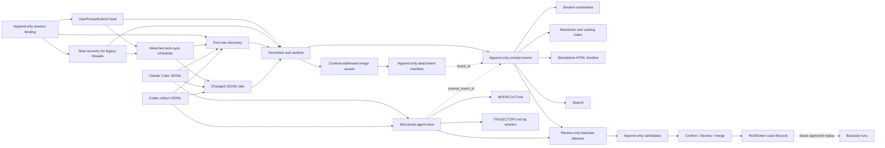

# Architecture

## Ingestion paths

The live path resolves and initializes the project, sanitizes one prompt, appends one JSON line under a lock, and updates a small session summary. If the user sent raster images, it additionally validates bounded local bytes, writes each unique image to a SHA-256-addressed path, and appends an attachment relation. It then launches a detached `auto-sync` process and returns without waiting. It never fetches a remote URL or calls a model, so reconciliation does not block the user's AI turn.

On a brand-new ledger whose lightweight indexes do not yet exist, the live path also materializes `PROMPTS.md`, `MODELOUT.md`, and `TRAJECTORY.md` from the already captured local facts before launching historical reconciliation. This one-time bootstrap makes the current session visible immediately; the detached worker later replaces the views with complete project history.

Plugin Hook definitions are loaded when a Codex task starts, while marketplace upgrades may replace versioned cache directories. The bundled command therefore does not execute a permanently captured `$PLUGIN_ROOT` path directly. At each invocation it first uses the loaded root when it still exists, otherwise locates the newest installed Prompt Harness launcher in the active Codex cache. The launcher treats a fully removed runtime as a successful no-op and converts capture exceptions into prompt-free diagnostics. Tasks created with this launcher continue working across later plugin upgrades; tasks created by older releases still need a restart or Stop recovery if their original cache has already disappeared.

Codex tasks created before a plugin hook was installed may keep their original plugin-hook set. An optional `Stop` recovery path initializes the project, uses that task's session ID to read only the latest human row from its native rollout after the turn completes, and schedules the same reconciliation. It records `source.mode=stop_recovery`. New tasks still use `UserPromptSubmit`; matching turn IDs plus prompt hashes prevent the two paths from duplicating an event.

## Automatic bootstrap and reconciliation

Each hook invocation schedules a background check. `state/auto-sync.json` tracks the last result and `state/source-cursors.json` tracks each known transcript's size, modification time, byte offset, and physical line count:

- a project without initialized cursors runs one full Claude/Codex discovery;
- every later interaction checks known source fingerprints and parses only complete JSONL lines appended after the cursor;
- a newly opened Claude source is discovered inside that project's direct Claude folder, including nested `subagents/` transcripts; the current Codex rollout is supplied by the hook or resolved by session ID;
- truncation, same-size rewrite, or an unterminated prior line falls back to rereading that one source file;
- `state/auto-sync.lock` serializes one project's worker, while a global lock serializes disk-heavy work across all projects;
- overlapping requests are coalesced in `state/auto-sync-pending.json` and consumed by the active worker;
- failed or interrupted runs retry on the next message, with no time-based throttle.

This is an eventual-consistency design: the current prompt is durable before the assistant starts, while older missing rows and images appear when the detached check completes. Ordinary turns do not enumerate or parse every local transcript.

Derived views use `state/index-dirty.json` to skip redundant rebuilds when reconciliation changed no prompt or image fact. Transcript-derived model mappings are cached in `state/source-models.json` by source size and modification time, so rebuilding a view does not repeatedly parse unchanged source transcripts.

After a full or incremental reconciliation has ingested every pending source tail, automatic sync runs the deterministic badcase candidate detector only when `badcases.automation_enabled` is explicitly set to `true`. The same opt-in gate controls configured Stop/Goal runs of explicitly approved `every-dev-completion` Feature Chains and Task Cases. The default is `false`; manual badcase and Test Hub commands remain available. The detached worker still performs at most one dirty index rebuild. Detection reads only local canonical facts, calls no model, and writes only review candidates. Test failures are recorded independently and never change hook success or prompt durability.

The recovery path scans native local transcripts. Claude Code branch copies are merged when timestamp and normalized prompt hash match; native IDs and every source reference are retained for provenance. Claude sidechains and Codex subagent rollouts are included in the trace ledger and marked with parent/agent metadata, while they remain excluded from the human-prompt ledger. If a Codex rollout was imported from Claude, rows at or before the source transcript's latest timestamp are mirror data; only genuinely new Codex continuation facts are candidates.

Automatic source ownership is an exact-root rule. A Claude transcript's first recorded `cwd` and a Codex rollout's `session_meta.cwd` must normalize to the project root exactly. Path containment is deliberately insufficient, so a parent project cannot absorb sessions launched in descendant folders. An active append-only session binding is authoritative and is the only supported cross-root override. Full discovery writes an authoritative cursor set, and incremental checks prune cursors whose sessions are no longer in scope.

## Reconciliation

A backfill first reconciles native message IDs and exact source path/line identities. It uses `(turn ID, prompt hash)` to match a source row to a source-less live hook event, then checks exact occurrence-time identity. During a complete historical scan it may finally match unclaimed occurrences by platform, session, and prompt hash. Incremental tails never use occurrence fallback because a tail may contain only the newest repeated prompt. This avoids re-adding a captured event or treating a changed attachment representation as a new prompt, while preserving distinct source lines even when one turn repeats identical text. If the prompt event already exists but its historical image relation does not, backfill appends only the missing relation.

Legacy versions represented images as prompt-text omission markers. If both an old marker event and a clean image-linked event already exist, Prompt Harness appends a relation to `state/event-supersessions.jsonl`; it does not delete either JSONL line. Active views, search, and future harness consumers use the clean canonical event.

If an older version captured a Codex AGENTS/environment envelope as a human prompt, reconciliation appends `state/event-exclusions.jsonl` with reason `automatic_context_not_human_input`. Raw event lines remain auditable; active views omit the excluded row.

If an older version captured an unbound session launched below the project root, reconciliation appends a project-scoped exact-root exclusion. The raw event is not deleted. Because exclusion evaluation consults the current session binding, explicitly binding that session to the project re-enables the event; rebinding it elsewhere hides the event again.

## Project resolution

Resolution order is:

1. explicit `--project` or `PROMPT_HARNESS_PROJECT_ROOT`;
2. latest append-only binding for `(platform, native session ID)`;
3. nearest existing `.prompt-harness/config.json`;
4. nearest Git root;
5. nearest `AGENTS.md`, `CLAUDE.md`, or common language project marker;
6. current working directory.

Resolution only identifies a candidate root. Automatic routing then applies a second gate: the native session launch `cwd` must equal the candidate root after normalization. A descendant directory does not inherit its parent's ledger. If the descendant has its own project marker, it may resolve as its own root and create its own ledger. An active native-session binding intentionally bypasses the exact-root relationship by making its destination authoritative.

Bindings live in `~/.prompt-harness/session-bindings.jsonl`. Rebinding appends a new record whose `replaces_binding_id` points to the previous active record; the latest valid record wins. A binding may retain the native transcript path so full discovery can include that exact source even when its historical `cwd` points elsewhere.

For Codex Stop recovery, an explicitly supplied transcript is opened first and its native `session_meta.id` and `session_meta.cwd` outrank stale payload values. An operator-triggered session migration reconciles that exact transcript into the bound destination, copies any retained user-image facts that are missing there, and appends exclusions to matching active rows in other registered stores. Canonical event lines are never deleted.

A user's home directory may itself be a project root for general sessions launched exactly there. Its project ledger may coexist with Prompt Harness's user-level registry and binding files under the same `.prompt-harness` directory because their paths do not overlap the canonical project fact directories. Descendant sessions do not inherit the home ledger. Filesystem and drive roots remain rejected.

Codex keeps rollouts in a global dated tree. After the first full scan, incremental reconciliation lists rollout filenames and opens only paths absent from the cursor set. This discovers sibling tasks launched later with the same exact `cwd` without reparsing established sources. `UserPromptSubmit` captures the human side immediately; `Stop` performs a second tail reconciliation so model output and the combined trajectory close the current turn. A stopped session remains resumable, so completion is a turn-level state rather than a permanent session state.

Native transcript roots default to `~/.codex` and `~/.claude`, but automatic discovery, Stop recovery, backfill, and migration honor `CODEX_HOME` and `CLAUDE_CONFIG_DIR`. Detached workers inherit the hook environment so custom Windows and cross-platform data locations remain addressable.

When Codex Desktop's `state_5.sqlite` is present and readable, discovery uses its thread IDs and exact `cwd` values as a read-only prefilter, then verifies matching rollout metadata before ingestion. This prevents first-use discovery from opening every unrelated rollout in a multi-gigabyte global session tree. Codex CLI-only installations retain the transcript-metadata fallback.

Project-wide `MODELOUT.md` contains the session index and complete final assistant answers. Project-wide `TRAJECTORY.md` contains the session index plus complete prompts and complete final answers in turn order, replacing intermediate event bodies with type counts. Neither view truncates prompt or final-answer text. Full projections remain partitioned into one file per session; no second Easy-named or project-wide full-process duplicate is generated. A session projection manifest fingerprints derived numbering and content so unchanged per-session files are not rewritten on every hook-triggered rebuild.

The Codex Stop foreground path reverse-reads only the rollout tail needed to recover the latest human message and its preceding model context. Complete trace reconciliation and index rebuilding remain detached background work.

## Concurrency and recovery

Writes use a cross-platform one-byte advisory lock, append-plus-fsync for events, image relations, supersession relations, and exclusion relations, content-addressed atomic image writes, and atomic replacement for cursors and derived JSON/Markdown files. Canonical JSONL is not silently rewritten. A malformed line can therefore be diagnosed without losing neighboring events.

Hook-boundary diagnostics live under `~/.prompt-harness/state/hook-errors.jsonl` and `plugin-hook-errors.jsonl`. They contain runtime metadata and exception text, never stdin or the submitted prompt body.

## Derived views

`index/PROMPTS.md`, `index/MODELOUT.md`, and `index/TRAJECTORY.md` are fact-only renderings with no project interpretation. `PROMPTS.md` embeds each locally archived image; `MODELOUT.md` renders typed, recursively sanitized trace events in audit order and links them to prompt events. `TRAJECTORY.md` contains every project session but isolates them by `(platform, session_id)`, then groups each session by native `turn_id`. All human messages submitted within one native turn are rendered first in source order, followed by that turn's linked injections, reasoning, tool traffic, subagent facts, and answer in native trace order. Independently identified subagent trajectories are nested under a known parent session and repeat the linked parent prompt as their turn anchor. Unlinked runtime facts appear only after all prompt-backed turns. The managed `index/prompt/`, `index/modelout/`, and `index/trajectory/` directories contain one corresponding file per session, using the shared pattern `UTC time-platform-model-session topic.md`; deterministic short hashes resolve filename collisions. JSONL preserves structured tool payloads and runtime metadata; Markdown shows both readable text and the structured JSON payload. Session titles, `reports/SESSION_SUMMARIES.md`, `index/sessions.json`, and `visualizations/timeline.html` are disposable views and may change as new facts arrive.

The project trajectory header reports total sessions, platform-specific session
counts, total normalized turns, total human prompts, and trace events. Its
session index reports per-session turn, prompt, and trace counts before the
detailed trajectories.

`index/BADCASES.md` is a lightweight review queue and confirmed-case catalog. `index/badcase/<case-id>.md` contains the complete referenced human prompts and final answers plus trace-category counts and links to the complete session trajectory. Candidate, decision, and case lifecycle JSONL remain canonical; the Markdown can be deleted and rebuilt.

Each generated event view receives a one-based `P` number after active events are sorted by occurrence time. An earlier recovered event therefore shifts every later P number. Exact timestamp ties use transcript path, source line, native message/turn identity, and finally `event_id` for deterministic ordering. Durable links always use the immutable `event_id`, not the derived P number.

When a historical event lacks a model in its canonical envelope, rebuild may resolve it from the original transcript: the next Claude assistant row for a Claude user message, or the active Codex `turn_context` for a Codex user message. The view labels this as transcript-derived and never rewrites the canonical JSONL line.
