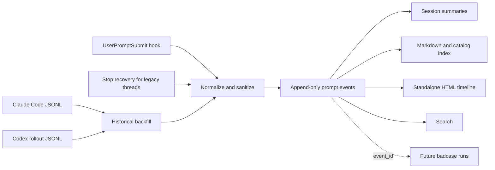

# Architecture

## Ingestion paths

The live path is intentionally short: resolve the project, sanitize one prompt, append one JSON line under a lock, and update a small session summary. It always returns success so an archival problem does not block the user's AI turn.

Codex tasks created before a plugin hook was installed may keep their original plugin-hook set. An optional `Stop` recovery path uses that task's session ID to read only the latest human row from its native rollout after the turn completes. It records `source.mode=stop_recovery`. New tasks still use `UserPromptSubmit`; matching turn IDs prevent the two paths from duplicating an event.

The recovery path scans native local transcripts. Claude Code branch copies are merged when timestamp and normalized prompt hash match; native IDs and every source reference are retained for provenance. Codex subagent rollouts are excluded. If a Codex rollout was imported from Claude, rows at or before the source transcript's latest timestamp are mirror data; only genuinely new Codex continuation prompts are candidates.

## Reconciliation

A backfill after live capture compares occurrence counts by platform, session, and prompt hash. This avoids re-adding the captured event while preserving a human who intentionally submitted the same words more than once. Event-ID checks provide a second guard.

## Project resolution

Resolution order is:

1. explicit `--project` or `PROMPT_HARNESS_PROJECT_ROOT`;
2. nearest existing `.prompt-harness/config.json`;
3. nearest Git root;
4. nearest `AGENTS.md`, `CLAUDE.md`, or common language project marker;
5. current working directory.

This keeps each project isolated without requiring every prompt to name the project.

## Concurrency and recovery

Writes use a cross-platform one-byte advisory lock, append-plus-fsync for events, and atomic replacement for derived JSON/Markdown files. Canonical JSONL is not silently rewritten. A malformed line can therefore be diagnosed without losing neighboring events.

## Derived views

`index/PROMPTS.md` is a fact-only rendering with no project interpretation. Session titles, `reports/SESSION_SUMMARIES.md`, `index/sessions.json`, and `visualizations/timeline.html` are disposable views and may change as new prompts arrive.

When a historical event lacks a model in its canonical envelope, rebuild may resolve it from the original transcript: the next Claude assistant row for a Claude user message, or the active Codex `turn_context` for a Codex user message. The view labels this as transcript-derived and never rewrites the canonical JSONL line.
