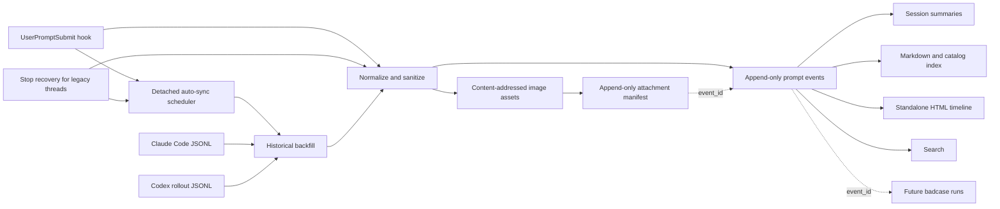

# Architecture

## Ingestion paths

The live path resolves and initializes the project, sanitizes one prompt, appends one JSON line under a lock, and updates a small session summary. If the user sent raster images, it additionally validates bounded local bytes, writes each unique image to a SHA-256-addressed path, and appends an attachment relation. It then launches a detached `auto-sync` process and returns without waiting. It never fetches a remote URL or calls a model, so historical reconciliation does not block the user's AI turn.

Codex tasks created before a plugin hook was installed may keep their original plugin-hook set. An optional `Stop` recovery path initializes the project, uses that task's session ID to read only the latest human row from its native rollout after the turn completes, and schedules the same full-project reconciliation. It records `source.mode=stop_recovery`. New tasks still use `UserPromptSubmit`; matching turn IDs prevent the two paths from duplicating an event.

## Automatic bootstrap and reconciliation

Each hook invocation schedules a background check. `state/auto-sync.json` tracks completed session keys and the last result:

- a never-seen Claude/Codex session always runs a full project reconciliation;
- a previously seen session runs again after the configured interval (five minutes by default);
- failed or interrupted runs retry on the next message;
- `state/auto-sync.lock` permits only one project scan at a time;
- foreground prompt capture still runs on every message, even when the background scan is throttled.

This is an eventual-consistency design: the current prompt is durable before the assistant starts, while older missing rows and images appear when the detached scan completes.

The recovery path scans native local transcripts. Claude Code branch copies are merged when timestamp and normalized prompt hash match; native IDs and every source reference are retained for provenance. Codex subagent rollouts are excluded. If a Codex rollout was imported from Claude, rows at or before the source transcript's latest timestamp are mirror data; only genuinely new Codex continuation prompts are candidates.

## Reconciliation

A backfill first reconciles native message IDs, turn IDs, and exact source path/line identities. It then compares occurrence counts by platform, session, and prompt hash. This avoids re-adding a captured event or treating a changed attachment representation as a new prompt, while preserving a human who intentionally submitted the same words more than once. If the prompt event already exists but its historical image relation does not, backfill appends only the missing relation.

Legacy versions represented images as prompt-text omission markers. If both an old marker event and a clean image-linked event already exist, Prompt Harness appends a relation to `state/event-supersessions.jsonl`; it does not delete either JSONL line. Active views, search, and future harness consumers use the clean canonical event.

## Project resolution

Resolution order is:

1. explicit `--project` or `PROMPT_HARNESS_PROJECT_ROOT`;
2. nearest existing `.prompt-harness/config.json`;
3. nearest Git root;
4. nearest `AGENTS.md`, `CLAUDE.md`, or common language project marker;
5. current working directory.

This keeps each project isolated without requiring every prompt to name the project.

## Concurrency and recovery

Writes use a cross-platform one-byte advisory lock, append-plus-fsync for events, image relations, and supersession relations, content-addressed atomic image writes, and atomic replacement for derived JSON/Markdown files. Canonical JSONL is not silently rewritten. A malformed line can therefore be diagnosed without losing neighboring events.

## Derived views

`index/PROMPTS.md` is a fact-only rendering with no project interpretation. It embeds each locally archived image through a relative path. Session titles, `reports/SESSION_SUMMARIES.md`, `index/sessions.json`, and `visualizations/timeline.html` are disposable views and may change as new prompts arrive.

When a historical event lacks a model in its canonical envelope, rebuild may resolve it from the original transcript: the next Claude assistant row for a Claude user message, or the active Codex `turn_context` for a Codex user message. The view labels this as transcript-derived and never rewrites the canonical JSONL line.
