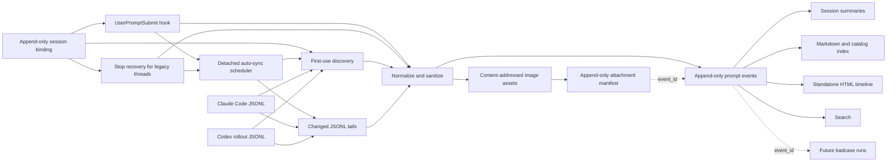

# Architecture

## Ingestion paths

The live path resolves and initializes the project, sanitizes one prompt, appends one JSON line under a lock, and updates a small session summary. If the user sent raster images, it additionally validates bounded local bytes, writes each unique image to a SHA-256-addressed path, and appends an attachment relation. It then launches a detached `auto-sync` process and returns without waiting. It never fetches a remote URL or calls a model, so reconciliation does not block the user's AI turn.

Codex tasks created before a plugin hook was installed may keep their original plugin-hook set. An optional `Stop` recovery path initializes the project, uses that task's session ID to read only the latest human row from its native rollout after the turn completes, and schedules the same reconciliation. It records `source.mode=stop_recovery`. New tasks still use `UserPromptSubmit`; matching turn IDs plus prompt hashes prevent the two paths from duplicating an event.

## Automatic bootstrap and reconciliation

Each hook invocation schedules a background check. `state/auto-sync.json` tracks the last result and `state/source-cursors.json` tracks each known transcript's size, modification time, byte offset, and physical line count:

- a project without initialized cursors runs one full Claude/Codex discovery;
- every later interaction checks known source fingerprints and parses only complete JSONL lines appended after the cursor;
- a newly opened Claude source is discovered by listing only that project's direct Claude folder; the current Codex rollout is supplied by the hook or resolved by session ID;
- truncation, same-size rewrite, or an unterminated prior line falls back to rereading that one source file;
- `state/auto-sync.lock` serializes one project's worker, while a global lock serializes disk-heavy work across all projects;
- overlapping requests are coalesced in `state/auto-sync-pending.json` and consumed by the active worker;
- failed or interrupted runs retry on the next message, with no time-based throttle.

This is an eventual-consistency design: the current prompt is durable before the assistant starts, while older missing rows and images appear when the detached check completes. Ordinary turns do not enumerate or parse every local transcript.

Derived views use `state/index-dirty.json` to skip redundant rebuilds when reconciliation changed no prompt or image fact. Transcript-derived model mappings are cached in `state/source-models.json` by source size and modification time, so rebuilding a view does not repeatedly parse unchanged source transcripts.

The recovery path scans native local transcripts. Claude Code branch copies are merged when timestamp and normalized prompt hash match; native IDs and every source reference are retained for provenance. Codex subagent rollouts are excluded. If a Codex rollout was imported from Claude, rows at or before the source transcript's latest timestamp are mirror data; only genuinely new Codex continuation prompts are candidates.

## Reconciliation

A backfill first reconciles native message IDs and exact source path/line identities. It uses `(turn ID, prompt hash)` to match a source row to a source-less live hook event, then checks exact occurrence-time identity. During a complete historical scan it may finally match unclaimed occurrences by platform, session, and prompt hash. Incremental tails never use occurrence fallback because a tail may contain only the newest repeated prompt. This avoids re-adding a captured event or treating a changed attachment representation as a new prompt, while preserving distinct source lines even when one turn repeats identical text. If the prompt event already exists but its historical image relation does not, backfill appends only the missing relation.

Legacy versions represented images as prompt-text omission markers. If both an old marker event and a clean image-linked event already exist, Prompt Harness appends a relation to `state/event-supersessions.jsonl`; it does not delete either JSONL line. Active views, search, and future harness consumers use the clean canonical event.

If an older version captured a Codex AGENTS/environment envelope as a human prompt, reconciliation appends `state/event-exclusions.jsonl` with reason `automatic_context_not_human_input`. Raw event lines remain auditable; active views omit the excluded row.

## Project resolution

Resolution order is:

1. explicit `--project` or `PROMPT_HARNESS_PROJECT_ROOT`;
2. latest append-only binding for `(platform, native session ID)`;
3. nearest existing `.prompt-harness/config.json`;
4. nearest Git root;
5. nearest `AGENTS.md`, `CLAUDE.md`, or common language project marker;
6. current working directory.

This keeps each project isolated without requiring every prompt to name the project.

Bindings live in `~/.prompt-harness/session-bindings.jsonl`. Rebinding appends a new record whose `replaces_binding_id` points to the previous active record; the latest valid record wins. A binding may retain the native transcript path so full discovery can include that exact source even when its historical `cwd` points elsewhere.

For Codex Stop recovery, an explicitly supplied transcript is opened first and its native `session_meta.id` and `session_meta.cwd` outrank stale payload values. An operator-triggered session migration reconciles that exact transcript into the bound destination, copies any retained user-image facts that are missing there, and appends exclusions to matching active rows in other registered stores. Canonical event lines are never deleted.

The user's home directory and filesystem roots are explicitly rejected as project roots. They are too broad to represent one project and would otherwise match unrelated transcript working directories.

## Concurrency and recovery

Writes use a cross-platform one-byte advisory lock, append-plus-fsync for events, image relations, supersession relations, and exclusion relations, content-addressed atomic image writes, and atomic replacement for cursors and derived JSON/Markdown files. Canonical JSONL is not silently rewritten. A malformed line can therefore be diagnosed without losing neighboring events.

## Derived views

`index/PROMPTS.md` is a fact-only rendering with no project interpretation. It embeds each locally archived image through a relative path. Session titles, `reports/SESSION_SUMMARIES.md`, `index/sessions.json`, and `visualizations/timeline.html` are disposable views and may change as new prompts arrive.

Each generated event view receives a one-based `P` number after active events are sorted by occurrence time. An earlier recovered event therefore shifts every later P number. Exact timestamp ties use transcript path, source line, native message/turn identity, and finally `event_id` for deterministic ordering. Durable links always use the immutable `event_id`, not the derived P number.

When a historical event lacks a model in its canonical envelope, rebuild may resolve it from the original transcript: the next Claude assistant row for a Claude user message, or the active Codex `turn_context` for a Codex user message. The view labels this as transcript-derived and never rewrites the canonical JSONL line.
